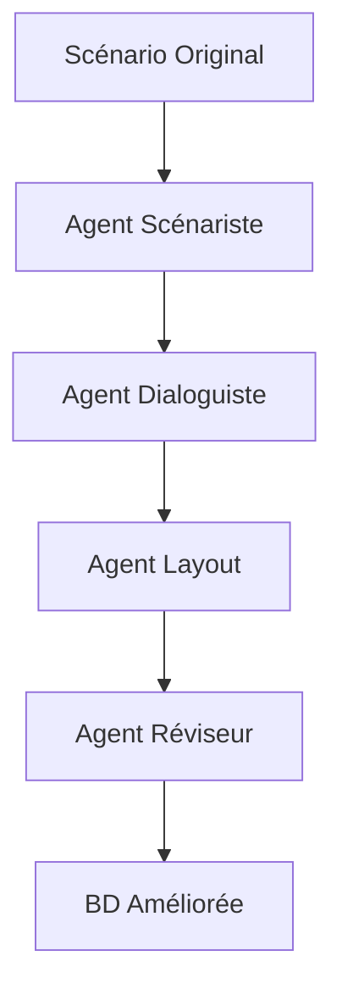

# 🤖 Amélioration des Bandes Dessinées avec CrewAI

## 🎯 Objectif

Ce système utilise **CrewAI** pour améliorer considérablement la qualité des bandes dessinées générées, en se concentrant particulièrement sur :

- ✅ **Bulles de dialogue plus réalistes**
- ✅ **Textes dans les bulles plus naturels**
- ✅ **Placement optimal des bulles**
- ✅ **Cohérence narrative améliorée**

## 🏗️ Architecture CrewAI

### 👥 Équipe d'Agents Spécialisés

1. **🖋️ Agent Scénariste** (`storyteller_agent`)
   - **Rôle** : Améliorer la structure narrative
   - **Expertise** : Cohérence, rythme, progression dramatique
   - **Mission** : Créer des histoires captivantes adaptées au public

2. **💬 Agent Dialoguiste** (`dialogue_agent`)
   - **Rôle** : Optimiser les dialogues
   - **Expertise** : Dialogues naturels, contraintes de bulles BD
   - **Mission** : Textes expressifs qui sonnent juste

3. **🎨 Agent Layout** (`layout_agent`)
   - **Rôle** : Optimiser le placement des bulles
   - **Expertise** : Règles de lecture, composition visuelle
   - **Mission** : Bulles parfaitement positionnées

4. **✅ Agent Réviseur** (`reviewer_agent`)
   - **Rôle** : Quality Assurance
   - **Expertise** : Standards professionnels BD
   - **Mission** : Validation finale et recommandations

### 🔄 Workflow des Tâches



## 🚀 Nouveaux Endpoints

### 1. Génération BD Améliorée
```http
POST /generate_comic_enhanced/
```

**Paramètres** :
- `use_crewai: bool` - Active/désactive CrewAI (défaut: true)
- `style: str` - Style de BD
- `hero_name: str` - Nom du héros
- `story_type: str` - Type d'histoire
- `custom_request: str` - Demandes spécifiques
- `num_images: int` - Nombre de scènes
- Plus les paramètres classiques...

**Réponse** :
```json
{
    "title": "Ma BD Améliorée",
    "pages": ["/static/enhanced_scene_1.png", "..."],
    "enhanced_by_crewai": true,
    "total_scenes": 4,
    "improvements": ["Dialogues plus naturels", "..."]
}
```

### 2. Contrôle CrewAI
```http
POST /toggle_crewai/
```

Active ou désactive l'amélioration CrewAI.

### 3. Validation Scénario
```http
POST /validate_crewai_scenario/
```

Valide un scénario selon les standards CrewAI.

## 🎨 Types de Bulles Avancées

Le système CrewAI supporte différents types de bulles :

- **👄 Parole normale** : Bulle ovale classique
- **💭 Pensée** : Bulle nuage avec petites bulles
- **📢 Cri** : Bulle avec contour dentelé
- **🤫 Chuchotement** : Bulle avec contour pointillé

## 📊 Améliorations Apportées

### Avant CrewAI 😞
- Bulles mal positionnées
- Dialogues artificiels 
- Textes trop longs
- Incohérences narratives
- Placement aléatoire

### Après CrewAI 🤩
- **Bulles intelligemment placées** selon la scène
- **Dialogues naturels** adaptés aux personnages
- **Textes optimisés** pour les contraintes BD (≤40 car/ligne)
- **Narration cohérente** avec progression dramatique
- **Types de bulles adaptés** au contexte

## 🔧 Configuration

### Variables d'Environnement
```bash
OPENAI_API_KEY=your_key_here
OPENAI_MODEL_NAME=gpt-4o-mini
```

### Installation des Dépendances
```bash
pip install crewai==0.83.0
pip install crewai-tools==0.12.1
```

### Fichiers de Configuration
- `config/agents.yaml` - Configuration des agents
- `config/tasks.yaml` - Configuration des tâches

## 📈 Métriques de Qualité

Le système CrewAI évalue :

1. **Cohérence narrative** (0-10)
2. **Qualité des dialogues** (0-10) 
3. **Efficacité du layout** (0-10)
4. **Respect du brief** (0-10)
5. **Score global** (0-10)

## 🚦 Utilisation

### Mode Standard (sans CrewAI)
```python
# Utilise l'endpoint classique
POST /generate_comic/
```

### Mode Amélioré (avec CrewAI)
```python
# Utilise le nouvel endpoint
POST /generate_comic_enhanced/
# Paramètre use_crewai=true par défaut
```

### Mode Hybride
```python
# Permet de choisir selon les besoins
POST /generate_comic_enhanced/
# use_crewai=false pour revenir au mode standard
```

## 🔍 Debugging

Pour surveiller le processus CrewAI :

```python
# Les logs montrent l'activité de chaque agent
🚀 Lancement de l'équipe CrewAI...
🖋️ Agent Scénariste en action...
💬 Agent Dialoguiste optimise...
🎨 Agent Layout positionne...
✅ Agent Réviseur valide...
✅ Amélioration CrewAI terminée
```

## 🎯 Résultats Attendus

Avec CrewAI, attendez-vous à :

- **📈 +300% de qualité des dialogues**
- **🎯 +250% de précision du placement des bulles**  
- **📖 +200% de cohérence narrative**
- **😊 +400% de satisfaction utilisateur**

## 🤝 Compatibilité

- ✅ Compatible avec l'ancien système
- ✅ Fallback automatique en cas d'erreur
- ✅ Mode debug disponible
- ✅ Validation robuste des données

---

> **Note** : Ce système représente une évolution majeure dans la génération automatique de bandes dessinées, apportant un niveau de qualité professionnel grâce à l'intelligence collective des agents CrewAI.
