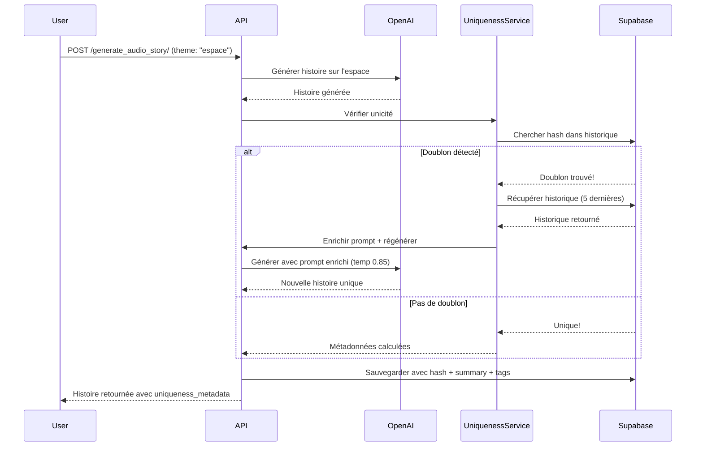

# 🎯 Système d'Unicité des Contenus - Herbbie

## 📋 Vue d'ensemble

Le système d'unicité garantit que les utilisateurs ne reçoivent **jamais de doublons exacts** lorsqu'ils génèrent plusieurs fois du contenu sur un même thème.

### Objectif
Éviter qu'un utilisateur qui demande 3 histoires sur "l'espace" reçoive la même histoire trois fois.

---

## 🏗️ Architecture

### 1. Base de données (Migration appliquée)

Deux nouveaux champs ajoutés à la table `creations` :

```sql
-- Hash SHA256 du contenu pour détecter les doublons exacts
content_hash TEXT

-- Résumé court (2-3 phrases) pour enrichir les prompts futurs
summary TEXT

-- Tags de variation stockés dans le champ 'data' (JSONB) existant
-- Exemple: {"variation_tags": {"theme": "espace", "custom_request": "..."}}
```

**Points clés** :
- ✅ Champs optionnels (NOT NULL = FALSE)
- ✅ Indices créés pour performance
- ✅ Pas d'impact sur les créations existantes

### 2. Service d'unicité (`uniqueness_service.py`)

Service isolé et non-bloquant qui gère :
- ✅ Calcul de hash SHA256 pour identification exacte
- ✅ Génération de résumés automatiques
- ✅ Extraction de tags de variation
- ✅ Vérification des doublons dans l'historique
- ✅ Enrichissement des prompts avec l'historique

### 3. Intégrations par type de contenu

#### Histoires (`/generate_audio_story/`)
- Vérifie le contenu après génération
- Si doublon exact détecté → **régénération automatique** (1 fois max)
- Prompt enrichi avec historique pour éviter répétitions
- Température augmentée légèrement (0.85 vs 0.7)

#### Coloriages (`/generate_coloring/`)
- Enrichit le prompt avec numéro de variation
- Hash basé sur le prompt (texte) plutôt que l'image
- Historique consulté avant génération

#### Comptines (`/generate_rhyme/`)
- Enrichit le prompt de paroles avec contexte d'historique
- Évite les thèmes/structures déjà utilisés
- Hash basé sur le thème + texte généré

#### Bandes Dessinées (`/generate_comic/`)
- Enrichit le custom_prompt avec variations suggérées
- Hash basé sur le synopsis
- Métadonnées stockées après génération complète

#### Animations (`/generate_animation/`)
- Enrichit le custom_prompt avec numéro de variation
- Hash basé sur thème + style + durée
- Historique consulté avant lancement de la tâche

---

## ⚙️ Configuration

### Variables d'environnement requises

```bash
# Supabase (requis pour l'unicité)
SUPABASE_URL=https://xfbmdeuzuyixpmouhqcv.supabase.co
SUPABASE_SERVICE_ROLE_KEY=votre_service_role_key

# Feature flag (optionnel)
ENABLE_UNIQUENESS_CHECK=true  # true par défaut
```

### Activer/Désactiver le système

Pour désactiver temporairement le système d'unicité :

```bash
ENABLE_UNIQUENESS_CHECK=false
```

Le système sera alors complètement bypass, sans erreur.

---

## 🔄 Flux de fonctionnement

### Exemple : Génération d'une histoire



---

## 📊 Métadonnées retournées

Chaque réponse d'API contient désormais (optionnel) :

```json
{
  "title": "Voyage dans les étoiles",
  "content": "Il était une fois...",
  "uniqueness_metadata": {
    "content_hash": "a3f5d8e9...",
    "summary": "Histoire d'un astronaute qui...",
    "variation_tags": {
      "content_type": "histoire",
      "theme": "espace",
      "custom_request": null,
      "generated_at": "2025-11-07T14:30:00Z"
    }
  }
}
```

**Ces métadonnées sont stockées dans le champ `data` (JSONB) de la table `creations`.**

---

## 🛡️ Sécurité et Robustesse

### Principe : Non-bloquant
Le système est conçu pour **JAMAIS casser** la génération de contenu :

```python
try:
    # Vérification unicité
    uniqueness_check = await uniqueness_service.ensure_unique_content(...)
except Exception as e:
    # En cas d'erreur, continuer normalement
    print(f"⚠️ Service unicité non disponible (non-bloquant): {e}")
    pass
```

### Cas d'erreur gérés
- ✅ Supabase indisponible → contenu généré normalement
- ✅ Service d'unicité en erreur → contenu généré normalement
- ✅ Utilisateur non connecté → pas de vérification, contenu généré
- ✅ Hash déjà existant mais impossible de régénérer → contenu initial retourné

### Permissions
- Le service utilise la `SUPABASE_SERVICE_ROLE_KEY`
- Bypass les RLS (Row Level Security)
- Permet l'accès à l'historique de tous les utilisateurs

---

## 📈 Performance

### Indices créés
```sql
-- Recherche rapide par hash
CREATE INDEX idx_creations_content_hash ON creations(content_hash);

-- Recherche rapide historique utilisateur
CREATE INDEX idx_creations_user_type_created ON creations(user_id, type, created_at DESC);
```

### Impact sur temps de génération
- Vérification d'unicité : **~50-100ms**
- Régénération si doublon : **+5-10s** (rare)
- Impact moyen : **négligeable**

---

## 🧪 Tests manuels

### Test 1 : Histoire unique
```bash
curl -X POST http://localhost:8000/generate_audio_story/ \
  -H "Content-Type: application/json" \
  -d '{
    "story_type": "espace",
    "custom_request": "",
    "user_id": "test-user-123"
  }'
```

Résultat attendu : Histoire générée avec `content_hash` différent à chaque fois.

### Test 2 : Vérification doublon
1. Générer 2 fois avec le **même prompt exact**
2. La 2ème fois devrait détecter le doublon et régénérer
3. Les hash doivent être différents

### Test 3 : Désactivation du service
```bash
export ENABLE_UNIQUENESS_CHECK=false
# Relancer l'app → aucune vérification d'unicité
```

---

## 🚀 Déploiement

### Railway
Le système est déjà intégré et déployé automatiquement avec :
- `requirements.txt` mis à jour (`supabase==2.10.0`)
- Variables d'environnement configurées sur Railway
- Migration SQL appliquée sur Supabase

### Variables à configurer sur Railway
```bash
SUPABASE_URL=https://xfbmdeuzuyixpmouhqcv.supabase.co
SUPABASE_SERVICE_ROLE_KEY=<votre_clé_service>
ENABLE_UNIQUENESS_CHECK=true
```

---

## 📝 Notes pour le développeur

### Ajouter l'unicité à un nouveau type de contenu

1. **Dans l'endpoint** (ex: `/generate_nouveau_type/`) :

```python
# Avant génération : récupérer l'historique
history = await uniqueness_service.get_user_history(
    supabase_client, user_id, "nouveau_type", theme, limit=5
)

# Enrichir le prompt si nécessaire
if history:
    enriched_prompt = uniqueness_service.enrich_prompt_with_history(
        base_prompt, history, "nouveau_type"
    )

# Après génération : vérifier unicité
uniqueness_check = await uniqueness_service.ensure_unique_content(
    supabase_client, user_id, "nouveau_type", theme,
    generated_content, custom_data
)

# Retourner avec métadonnées
return {
    ...,
    "uniqueness_metadata": uniqueness_check
}
```

2. **Toujours wrapper dans try/except** pour garantir la non-blocage

### Hash personnalisé
Pour certains types de contenu (images, audio), créer un hash basé sur les paramètres :

```python
content_for_hash = f"{theme}_{custom_prompt}_{style}_{duration}"
```

---

## 🎯 Résumé

| Fonctionnalité | État | Impact utilisateur |
|---------------|------|-------------------|
| Détection doublons exacts | ✅ Actif | Aucun doublon exact possible |
| Enrichissement prompts | ✅ Actif | Variations automatiques |
| Régénération auto | ✅ Actif (histoires) | Meilleure diversité |
| Métadonnées tracking | ✅ Actif | Traçabilité complète |
| Non-bloquant | ✅ Garanti | Zéro impact si erreur |
| Performance | ✅ Optimisé | Indices DB créés |

---

## 🔗 Fichiers modifiés

1. **Migration SQL** : Appliquée via Supabase MCP
2. **`services/uniqueness_service.py`** : Service principal (nouveau)
3. **`main.py`** : Intégration histoires, coloriages, BD, animations
4. **`routes/rhyme_routes.py`** : Intégration comptines
5. **`requirements.txt`** : Ajout de `supabase==2.10.0`

---

## 📞 Support

En cas de problème :
1. Vérifier les logs : `⚠️ Service unicité non disponible`
2. Vérifier la config Supabase (`SUPABASE_SERVICE_ROLE_KEY`)
3. Désactiver temporairement : `ENABLE_UNIQUENESS_CHECK=false`

**Le système est conçu pour ne jamais bloquer la production. En cas de doute, il permet la génération normale.**

